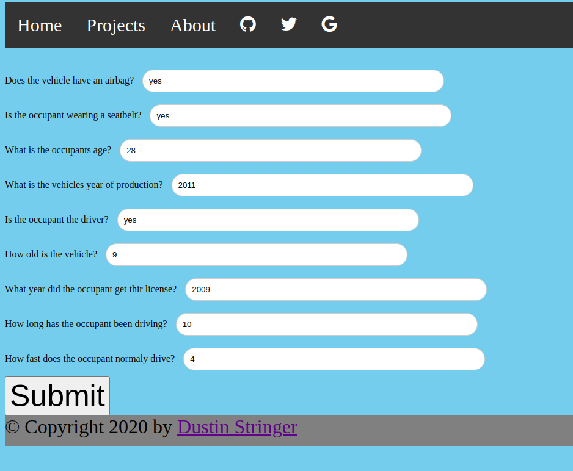
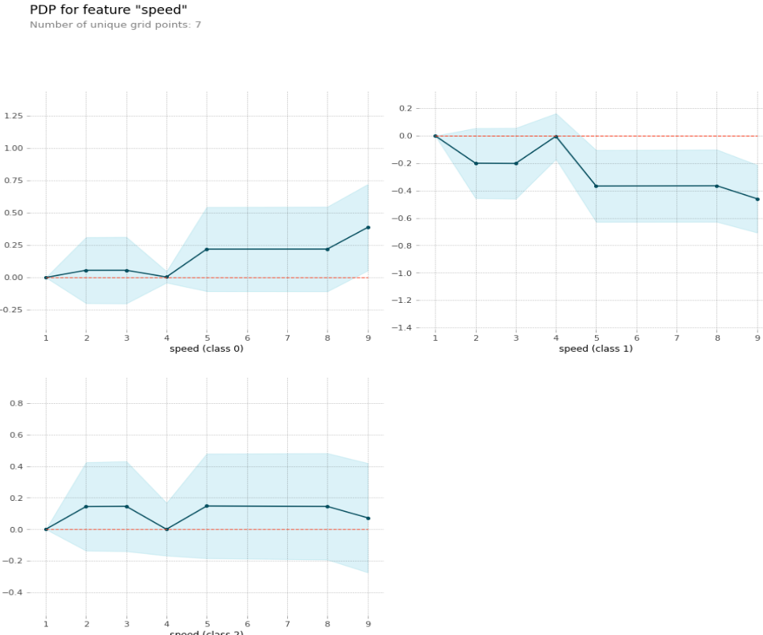
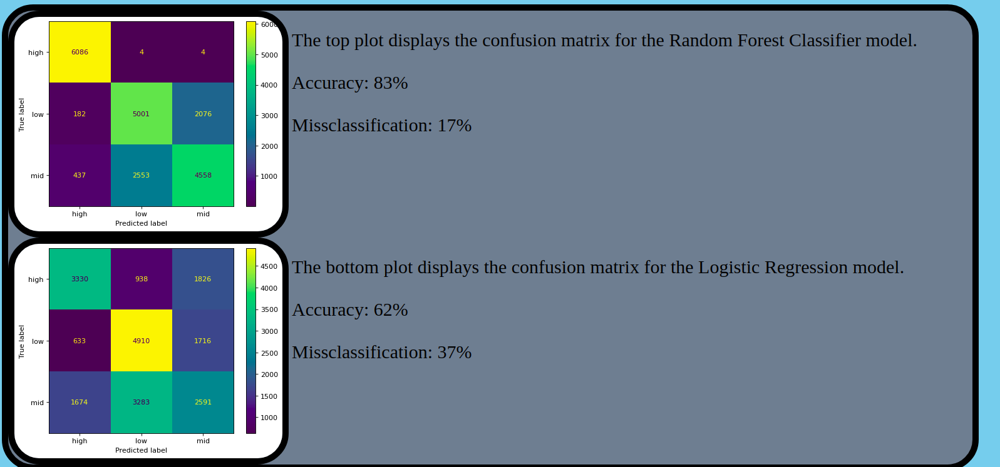

  Most of us spend a majority of our lives in a 
vehicle going from 'a' to 'b'. 
  In light of that I decided to make predictive 
model that can tell you the injury severity of a possible collision.

### ***Figure1:***

- Above in ***figure 1*** you can see the inputs page of the model-app ( still in development ), I've entered some basic information for the model to use, such as age, driving experience, speed, etc.. With these inputs the predictive model will process them on the back end and return a page with a prediction of you the injury severity.

---
---

## Now let's see the results the model returns based on the inputs it was given.

## WE HAVE A PREDICTION!!

### ***Figure2:***

- This figure shows us the shaply plot, which explaines variables and how much each contributed to the outcome of the model. This isnt magic, thought it seems so. Shaply values are calculated using Game Theory.

### ***Figure3:***

- Here in figure3 is a plot showing speed in isolation. This plot is another way to show the impact a specific feature is having on the model and each of its predictable classes. In this plot I just used "speed" since it had the most impact out of all the other features.

### ***Figure4:***
